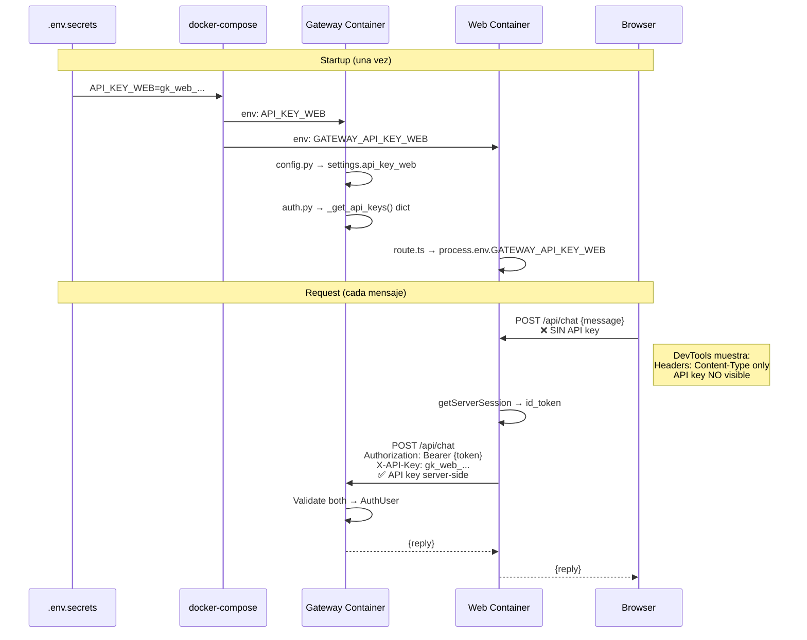

# API Key — Flujo de la key (nunca visible al browser)

```mermaid
sequenceDiagram
    participant ENV as .env.secrets
    participant DC as docker-compose
    participant GW as Gateway Container
    participant WEB as Web Container
    participant BR as Browser

    Note over ENV,BR: Startup (una vez)
    ENV->>DC: API_KEY_WEB=gk_web_...
    DC->>GW: env: API_KEY_WEB
    DC->>WEB: env: GATEWAY_API_KEY_WEB

    GW->>GW: config.py → settings.api_key_web
    GW->>GW: auth.py → _get_api_keys() dict

    WEB->>WEB: route.ts → process.env.GATEWAY_API_KEY_WEB

    Note over ENV,BR: Request (cada mensaje)
    BR->>WEB: POST /api/chat {message}<br/>❌ SIN API key
    Note right of BR: DevTools muestra:<br/>Headers: Content-Type only<br/>API key NO visible

    WEB->>WEB: getServerSession → id_token
    WEB->>GW: POST /api/chat<br/>Authorization: Bearer {token}<br/>X-API-Key: gk_web_...<br/>✅ API key server-side

    GW->>GW: Validate both → AuthUser
    GW-->>WEB: {reply}
    WEB-->>BR: {reply}
```
