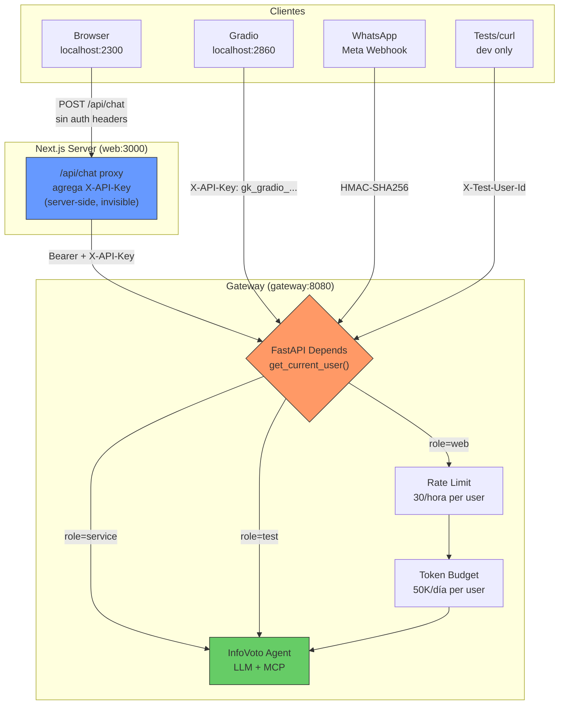

# Auth Flow — Todos los canales

```mermaid
flowchart TB
    subgraph Clientes
        WEB[Browser<br/>localhost:2300]
        GRAD[Gradio<br/>localhost:2860]
        WA[WhatsApp<br/>Meta Webhook]
        TEST[Tests/curl<br/>dev only]
    end

    subgraph "Next.js Server (web:3000)"
        PROXY["/api/chat proxy<br/>agrega X-API-Key<br/>(server-side, invisible)"]
    end

    subgraph "Gateway (gateway:8080)"
        AUTH{"FastAPI Depends<br/>get_current_user()"}
        RATE[Rate Limit<br/>30/hora per user]
        BUDGET[Token Budget<br/>50K/día per user]
        AGENT[InfoVoto Agent<br/>LLM + MCP]
    end

    WEB -->|POST /api/chat<br/>sin auth headers| PROXY
    PROXY -->|Bearer + X-API-Key| AUTH

    GRAD -->|X-API-Key: gk_gradio_...| AUTH
    WA -->|HMAC-SHA256| AUTH
    TEST -->|X-Test-User-Id| AUTH

    AUTH -->|role=web| RATE
    AUTH -->|role=service| AGENT
    AUTH -->|role=test| AGENT
    RATE --> BUDGET
    BUDGET --> AGENT

    style AUTH fill:#f96,stroke:#333
    style PROXY fill:#69f,stroke:#333
    style AGENT fill:#6c6,stroke:#333
```
