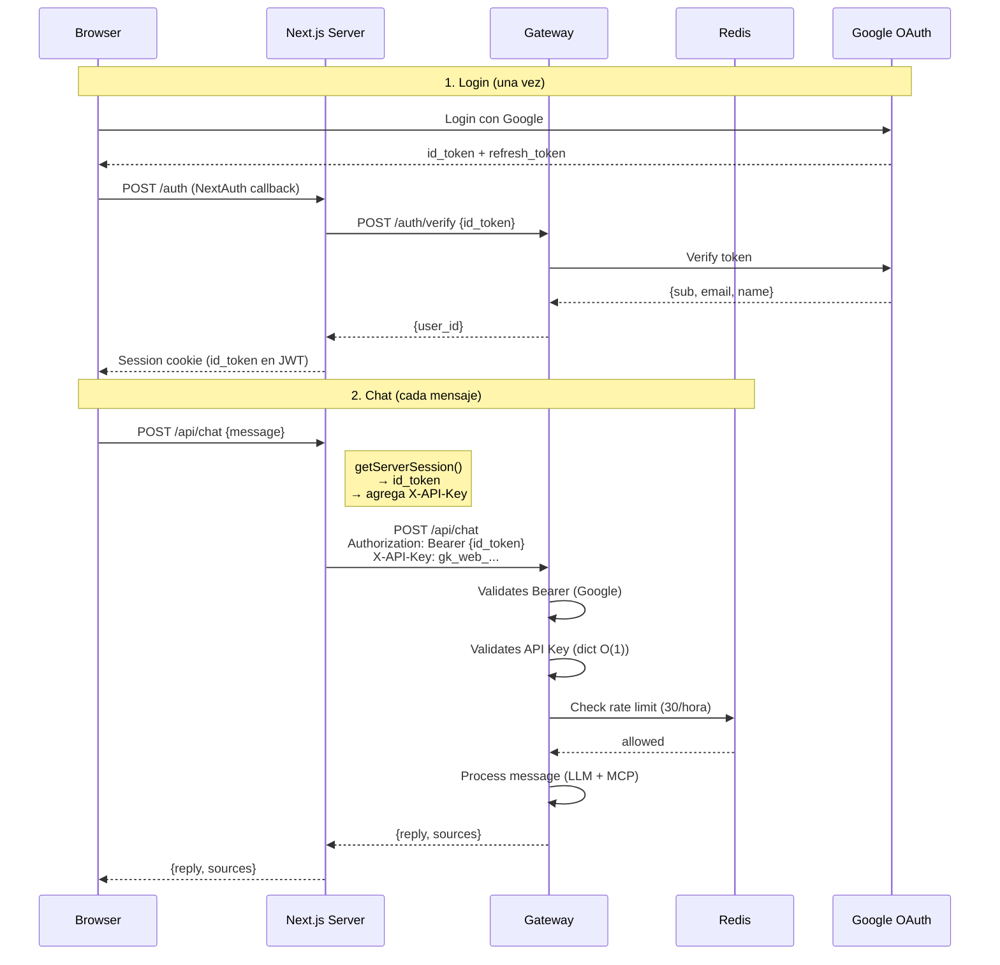

# Auth Flow — Web (Browser → Next.js → Gateway)

```mermaid
sequenceDiagram
    participant B as Browser
    participant N as Next.js Server
    participant G as Gateway
    participant R as Redis
    participant GG as Google OAuth

    Note over B,GG: 1. Login (una vez)
    B->>GG: Login con Google
    GG-->>B: id_token + refresh_token
    B->>N: POST /auth (NextAuth callback)
    N->>G: POST /auth/verify {id_token}
    G->>GG: Verify token
    GG-->>G: {sub, email, name}
    G-->>N: {user_id}
    N-->>B: Session cookie (id_token en JWT)

    Note over B,R: 2. Chat (cada mensaje)
    B->>N: POST /api/chat {message}
    Note right of N: getServerSession()<br/>→ id_token<br/>→ agrega X-API-Key
    N->>G: POST /api/chat<br/>Authorization: Bearer {id_token}<br/>X-API-Key: gk_web_...
    G->>G: Validates Bearer (Google)
    G->>G: Validates API Key (dict O(1))
    G->>R: Check rate limit (30/hora)
    R-->>G: allowed
    G->>G: Process message (LLM + MCP)
    G-->>N: {reply, sources}
    N-->>B: {reply, sources}
```
