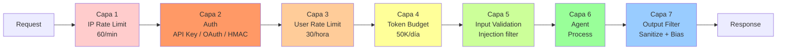

# Capas de Seguridad

```mermaid
flowchart LR
    REQ[Request] --> IP[Capa 1<br/>IP Rate Limit<br/>60/min]
    IP --> AUTH[Capa 2<br/>Auth<br/>API Key / OAuth / HMAC]
    AUTH --> USER[Capa 3<br/>User Rate Limit<br/>30/hora]
    USER --> TOKEN[Capa 4<br/>Token Budget<br/>50K/día]
    TOKEN --> INPUT[Capa 5<br/>Input Validation<br/>Injection filter]
    INPUT --> AGENT[Capa 6<br/>Agent<br/>Process]
    AGENT --> OUTPUT[Capa 7<br/>Output Filter<br/>Sanitize + Bias]
    OUTPUT --> RES[Response]

    style IP fill:#fcc
    style AUTH fill:#f96
    style USER fill:#fc9
    style TOKEN fill:#ff9
    style INPUT fill:#cf9
    style AGENT fill:#9f9
    style OUTPUT fill:#9cf
```
