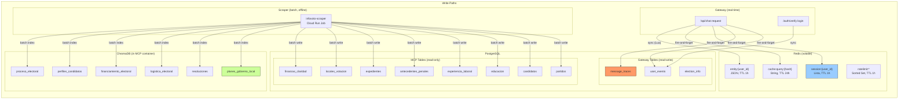

# Data Flow — Write Paths

```mermaid
flowchart TB
    subgraph "Write Paths"
        direction TB

        subgraph "Scraper (batch, offline)"
            SCR[infovoto-scraper<br/>Cloud Run Job]
        end

        subgraph "Gateway (real-time)"
            CHAT["/api/chat request"]
            AUTH["/auth/verify login"]
        end

        subgraph "PostgreSQL"
            subgraph "MCP Tables (read-only)"
                T1[partidos]
                T2[candidatos]
                T3[educacion]
                T4[experiencia_laboral]
                T5[antecedentes_penales]
                T6[expedientes]
                T7[locales_votacion]
                T8[finanzas_claridad]
            end

            subgraph "Gateway Tables (read-write)"
                T9[user_events]
                T10[message_traces]
                T11[election_info]
            end
        end

        subgraph "Redis (volatile)"
            R1["session:{user_id}<br/>Lista, TTL 1h"]
            R2["cache:query:{hash}<br/>String, TTL 24h"]
            R3["entity:{user_id}<br/>JSON, TTL 1h"]
            R4["ratelimit:*<br/>Sorted Set, TTL 1h"]
        end

        subgraph "ChromaDB (in MCP container)"
            C1[planes_gobierno_local]
            C2[resoluciones]
            C3[logistica_electoral]
            C4[financiamiento_electoral]
            C5[perfiles_candidatos]
            C6[proceso_electoral]
        end
    end

    SCR -->|"batch write"| T1 & T2 & T3 & T4 & T5 & T6 & T7 & T8
    SCR -->|"batch index"| C1 & C2 & C3 & C4 & C5 & C6

    CHAT -->|"fire-and-forget"| T9
    CHAT -->|"fire-and-forget"| T10
    CHAT -->|"fire-and-forget"| R1
    CHAT -->|"fire-and-forget"| R2
    CHAT -->|"sync (Lua)"| R3

    AUTH -->|"sync"| T9

    style T10 fill:#f96,stroke:#333
    style R1 fill:#9cf,stroke:#333
    style C1 fill:#cf9,stroke:#333
```
